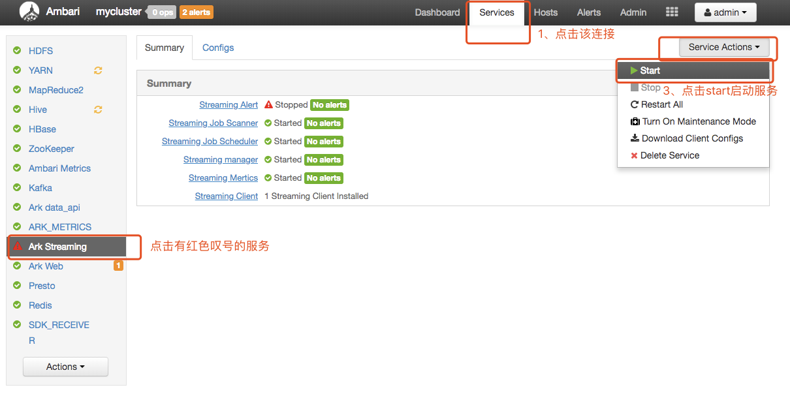
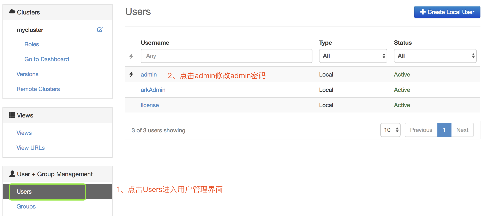

# 方舟Argo自动化安装文档

# 目录

- [环境准备](#环境准备)
  * [系统要求](#系统要求)
  * [网络要求](#网络要求)
  * [硬件要求](#硬件要求)
  * [系统要求](#系统要求)
  * [安装包说明](#安装包说明)
- [开始安装](#开始安装)
  * [准备工作](#准备工作)
  * [配置/etc/hosts](#配置/etc/hosts)
  * [开始安装](#开始安装)
  * [导入License](#导入License)
  * [初始化收数地址](#初始化收数地址)
- [开始使用](#开始使用)
  * [管理后台](#管理后台)
  * [数据接入](#数据接入)
- [社群](#社群)

# 环境准备

## 系统要求
请尽量不要让您的公网ip直接对外，不然会有中毒的风险。您可以使用内网ip通过网关的方式来访问外网。

方舟Argo安装部署手册的主要目的是指导使用该系统的用户方便快捷的安装系统和配置。
如果您已经下载好了安装包，请参考[离线安装](#offline_install)。

## 网络要求
能连通外网


## 硬件要求
* 测试环境：
    * 8Core 32G内存 
    * 系统盘:50G 
    * 数据盘:250G硬盘。
* 正式环境：
    * 16Core64G内存 
    * 系统盘:300G 
    * 数据盘:>500G磁盘，并且做RAID1或更高级别的配置。

## 系统要求
| 系统及其组件 | 系统要求                                        |
| ------------ | :---------------------------------------------- |
| 操作系统     | CentOS 7和 Redhat 7版本、强烈建议CentOS7.4      |
| 磁盘目录     | 系统盘：一定要有/opt目录,最终只识别/data1目录。 |
| 主机名       | 不能大写,不能有下划线"_"                        |
| 系统编码     | UTF-8                                           |
| 软件环境     | 不支持混合部署                                  |

## 安装包说明

* standalone_remote_installer.sh  远程安装脚本
* standalone_offline_installer.sh 本地安装脚本
* init_ext4.sh 环境检查脚本，检查环境是否有问题

# 1.开始安装

## 1.1准备工作

以下操作以4.1.17版本为样例，有些操作中涉及到的文件需要根据您安装的具体的版本号来定

* 创建目录

    先创建/opt/soft目录，/opt目录应该在系统盘上，可参考如下命令
    ```
    mkdir /opt/soft
    ```

* 在线安装
    1. 从 https://github.com/analysys/argo-installer 地址下载argo-installer项目，解压后将config.properties和standalone_remote_installer.sh , init_ext4.sh放到/opt/soft目录下
    
        ```
        yum install wget unzip -y
        cd /tmp
        wget https://github.com/analysys/argo-installer/archive/master.zip
        unzip master.zip
        cp argo-installer-master/config.properties /opt/soft/
        cp argo-installer-master/standalone_remote_installer.sh /opt/soft/
        cp argo-installer-master/init_ext4.sh /opt/soft/
        ```

* <span id="offline_install">离线安装</span> _**在线自动安装，跳过该步骤**_
    1. argo-repo-url地址下载安装包，或者通过百度网盘下载
    
    
    2. 将下载的analysys_installer_base_centos7.tar.gz ， analysys_installer_base_centos7.tar.gz.md5 ， ark_centos7_4.1.17.tar.gz ， ark_centos7_4.1.17.tar.gz.md5 4个文件放到服务器/opt/soft目录下。
    
    3. 从https://github.com/analysys/argo-installer地址下载argo-installer项目,然后解压后将config.properties和standalone_offline_installer.sh , init_ext4.sh文件放到服务器/opt/soft目录下
    
    4. **如果您通过windows机器下载脚本并上传到服务器上，过程中可能会导致shell脚本的文件格式变成dos，所以请先使用如下命令将shell脚本格式做个转换**
       
       ```
       cd /opt/soft
       
       #下载安装dos2unix工具
       yum install dos2unix -y
       
       #转换文件格式
       dos2unix init_ext4.sh
       
       #如果使用离线安装
       dos2unix standalone_offline_installer.sh
       ```
    

* 后续操作
    
    将init_ext4.sh脚本拷贝到机器上/opt/soft目录，执行该脚本检查机器是否满足要求。需要使用root用户或有sudo权限的普通用户
    
    ``` bash
    sudo sh init_ext4.sh
    ```

## 1.2配置/etc/hosts

1. 如果所有主机都已经有hostname，则直接进行第2步操作，如果没有配置，则需要给服务器设置hostname

    1.1 登陆服务器，执行
    ```bash
    hostname -f
    ```
    
    1.2 查看该服务器的主机名,如果返回的结果不是ark1，则说明该服务器没有设置主机名。

    1.3 以root用户或sudo执行
    ```bash
    hostnamectl set-hostname ark1
    ```
    1.4 检查主机名是否设置成功：
    ```bash 
    hostname -f 
    ```
    命令查看返回值，如果是我们设置的主机名，主机名设置成功！

2. 配置/etc/hosts文件，使用vi命令编辑该文件

```
vi /etc/hosts
```
添加内容如下
```
${该服务器的内网ip} ark1.analysys.xyz ark1 
```
注意，目前只支持 ark1.analysys.xyz，这个/etc/hosts文件也必须这么写

有3列内容，第一列为主机的ip地址，第二列是Ambari使用的FANQ格式的主机名,第三列是该ip对应的主机名。

保存后将该文件复制到所有服务器的/etc目录下。

## 2.开始安装

### 2.1安装
以下操作以4.1.17版本为样例
1. 在线安装：配置服务器下载地址，修改/opt/soft/config.properties文件
    ```bash
    repo_url=argo-repo-url
    ```

    ```bash
    cd /opt/soft
    sh standalone_remote_installer.sh install Grafana_123 4.1.17 centos7 root 'HJUiju)@)$' platformName  32 
    ```
2. 离线安装：
    ```bash
    cd /opt/soft
    sh standalone_offline_installer.sh install Grafana_123 4.1.17 centos7 root 'HJUiju)@)$' platformName  32 
    ```

3. 参数定义：    
    
    | 参数         | 定义                                                               |
    | :----------- | :----------------------------------------------------------------- |
    | Grafana_123  | 你的mysql的root密码                                                |
    | 4.1.17      | 你要安装的方舟的版本号                                             |
    | centos7      | 你的操作系统的类型，目前全面支持centos6和centos7,redhat6,redhat7系列                          |
    | root         | 安装用户，如果使用非root用户安装，要求这个用户必须有免密码sudo能力 |
    | 'HJUiju)@)$' | 你使用的用户的密码                                                 |
    | platformName | 你这套环境名称，只能是英文字母和数字                               |
    | 32           | 你服务器内存的大小，目前全面支持32/64/128三种配置，如果您机器内存在这三个数字之间，比如40G内存，建议向下取32。                                |
    
    _注意：该脚本不允许nohup后台执行，因为过程中会有询问您的操作的过程，所以请关注脚本的输出。_
    
    在安装的过程中可以通过访问 http://ark1.analysys.xyz:8080 界面来查看安装细节，但请不要做任何操作。
    
    等待脚本执行完成。
    
    如果这一步安装报错或意外退出了终端，请参考安装问题处理文档 http://geek.analysys.cn/topic/56 文档
    
4. 安装过程中需要交互确认，需要您输入y或yes来确认
    
    1. 是否分发jdk,配置系统ulimit参数，是否安装并配置ntp
    
        ```
        ******************************************************************************
         ============step 3 .开始分发安装 jdk,config ulimit,ntp......================= 
        if install install jdk and change ulimit ...in all host  [y/n]:
        ```
        输入```y``` 即可
    
    2. 打通免密
    
        ```
        The authenticity of host 'ark1.analysys.xyz (172.31.45.102)' can't be established.
        ECDSA key fingerprint is SHA256:x5kT/VUuQMVZy9O4lOKZCLxM6gEFoARECU2Tul8vhvs.
        ECDSA key fingerprint is MD5:b4:0b:ea:00:e9:65:b2:f3:10:7d:bb:43:d6:a4:9b:3a.
        Are you sure you want to continue connecting (yes/no)?
        ```
        输入 ```yes``` 即可
    
    3. 是否配置自己的时间同步操作
    
        ```
        if install your own time server [y/n]:
        ```
        输入 ```y``` 即可
    
    

### 2.2安装完成后，检查未成功启动的服务：

浏览器输入 http://${该服务器的内网ip}:8080

账密为 admin/admin

登陆进入后操作如下：

按上图中的1、2、3步骤操作完成，直到没有红色叹光的服务。另外需要注意的是，由于服务状态检查有一定的延时，所以在安装完成过几分钟后再进行该操作，操作完成后也需要观察一段时间再看结果。


## 3.导入License

这一步骤的所有操作需要在**streaming**用户下执行，所以需要先切换到streaming用户。

开始导入license，依次执行如下命令
```bash
#先退出终端再登入，保证所有环境变量被加载
exit

#重新登入终端
sudo su - streaming
/opt/soft/streaming/bin/init_license_info.sh 1 495D220F07341C03B1FC7CB4F25455227B29990C9B7511C26FEE4C76D72E1D14477CC6AD54741B8414DE9BF2B787351FA2E2F4FC9DF24F19FBDD4395BB2CC0A645FC2E9749DEA34A09FB58378D758E0A9903E2642F10FC464F5AF8D7A6AC41B31065A6D0CF2EE9FD1B047C5B40B24C76848C3568C3ACE24E3C48C5796E7CC585D4587CA5D4F3FC17F6C45C71426E4867DDA80A10D26E79E95DA2437DC72A428193B728B51A9D77914C7C5437C6CFD1B3
/opt/soft/streaming/bin/update_enterprise_code.sh wByeDrLc 1
```

## 4.初始化收数地址

SDK往方舟里上报数据，需要知道方舟收数的地址。默认情况下，可以使用 http://${该服务器的外网ip}:8089 来上报数据，我们将该地址导入到方舟中。
```bash
sudo su - streaming
/opt/soft/streaming/bin/init_data_entrance_url.sh http://${该服务器的外网ip}:8089
```
但是IOS的SDK上报数据需要https，这种情况下，您需要单独部署一套nginx的服务器，并配置域名访问。具体请参考文档：《部署前置nginx》

# 5.开始使用

## 管理后台

服务正常运行后，通过下列地址登录管理后台。

```
http://ip:4005/
```
初始账密为：

```
admin/111111
```
接下来，你为自己创建一个日常使用的[账号](https://ark.analysys.cn/docs/enterprise-basic-function-member.html)，并创建一个[项目](https://ark.analysys.cn/docs/enterprise-basic-function-project-management.html)。

## 数据接入

完成了上述步骤就正式进入了易观方舟Argo的探索之旅，下面是一些快速开始的文档：

- [接入前准备](https://ark.analysys.cn/docs/integration-prepare.html)
- [SDK指南](https://ark.analysys.cn/docs/sdk.html)
- [功能使用说明](https://ark.analysys.cn/docs/function.html)
- [常见问题](https://ark.analysys.cn/docs/faq.html)

## 删除项目
argo可以在管理界面上通过项目管理模块来创建项目，但如果您想删除项目，需要您登陆argo的后台操作。
```
su - streaming
/opt/soft/streaming/drop_project.sh $appkey
```

## 6.后续操作建议

### 开启自动恢复功能，开启后，异常挂掉的服务会自己恢复重启


然后:


### 修改Ambari管理员用户admin的密码

然后:

完成！

# 社群

希望我们的努力可以解放更多人的生产力，祝你使用顺利！

官方论坛 https://geek.analysys.cn
